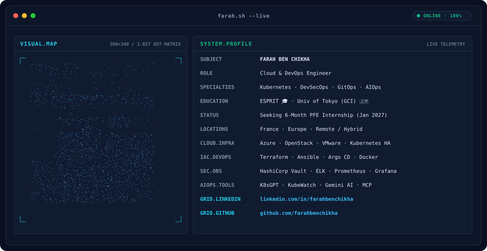

<div align="center">



</div>

<br>

<div align="center">

# FARAH BEN CHIKHA

### Cloud & DevOps Engineer · Kubernetes · DevSecOps · AIOps

🇹🇳 Tunisia · 🎓 ESPRIT · 🇨🇳 China

</div>

---

## `WHOAMI`

I'm a Computer Engineering student specializing in **Cloud Computing**, with a strong interest in building reliable, automated and secure infrastructure.

My focus is at the intersection of:

* ☁️ **Cloud Engineering**
* ☸️ **Kubernetes & Container Platforms**
* ⚙️ **DevOps / GitOps**
* 🔐 **DevSecOps**
* 🤖 **AIOps & Intelligent Infrastructure**

Currently looking for a **6-month PFE internship starting January 2027** in:

**Cloud Engineering · DevOps · DevSecOps · Kubernetes · AIOps**

📍 France · Europe · Remote / Hybrid

---

## `ENGINEERING.STACK`

### ☁️ Cloud & Infrastructure

<p>


</p>

### ☸️ Containers & Kubernetes

<p>


</p>

### ⚙️ IaC / Automation / DevOps

<p>


</p>

### 🔐 Security / Observability / AIOps

<p>


</p>

---

## `FEATURED.PROJECTS`

### 🚀 Kubernetes Enterprise Platform

**Cloud Infrastructure · Kubernetes · GitOps · DevSecOps · AIOps**

A Kubernetes-based enterprise platform designed for microservices hosting with infrastructure automation, security and intelligent operations.

**Core architecture**

`Terraform` → `Ansible` → `VMware` → `Kubernetes HA` → `Argo CD`

**Security & Operations**

`Vault` · `ELK` · `KubeWatch` · `K8sGPT` · `Gemini AI` · `MCP`

**Focus**

> Infrastructure as Code · GitOps · DevSecOps · Observability · AI-assisted diagnosis

---

### 🏋️ Pour la Forme

**Spring Boot · Angular · MySQL · OpenStack · Ansible · Kubernetes**

Full-stack platform combining application development with cloud infrastructure automation.

* ☁️ OpenStack infrastructure
* ⚙️ Ansible automation
* ☸️ Kubernetes / containerized deployment
* 🔐 JWT authentication
* 🤖 AI chatbot & analytics
* 📊 Gym management & reservation
* 🎨 Three.js gym creator

---

### 📊 Intelligent Retail Decision System

**Python · Flask · Pandas · Scikit-learn**

Machine Learning platform for retail decision support.

* Demand forecasting
* Stockout detection
* Customer / product segmentation with DBSCAN
* Regression & classification
* Model serialization with Joblib

---

## `CERTIFICATIONS`

| Certification / Program         | Organization       | Year |
| ------------------------------- | ------------------ | ---: |
| Cloud Computing                 | Microsoft          | 2026 |
| Data Engineering & MLOps        | —                  | 2026 |
| Foundations in Agentic AI       | GitHub / Microsoft | 2026 |
| AI Security & GenAI Red Teaming | —                  | 2026 |
| Anomaly Detection               | NVIDIA             | 2025 |
| Fundamentals of Deep Learning   | NVIDIA             | 2025 |
| CCNA                            | Cisco              | 2025 |
| Exploring SAP Cloud ERP         | SAP                | 2024 |

---

## `EXPERIENCE & COMMUNITY`

### 🌍 Global AI / Technical Programs

**GCI World 2026 — University of Tokyo**

Global AI cohort organized by the Matsuo & Iwasawa Laboratory.

**MASSAI 2026 — Mediterranean & African Summer School on AI**

Topics included:

`Agentic AI` · `AI Orchestration` · `Data Engineering` · `MLOps` · `AI Security` · `GenAI Red Teaming`

### IEEE ESPRIT

Active IEEE member with involvement in:

* IEEE SIGHT
* IEEE Women in Engineering
* Technical & community events
* Technology challenges
* Tech4Good initiatives

🏆 **SDC 3.0 — 1st Prize**

---

## `GITHUB.SIGNALS`

<div align="center">


</div>

<br>

<div align="center">


</div>

---

## `CURRENT.FOCUS`

```text
┌─────────────────────────────────────────────────────┐
│                                                     │
│  ☁ CLOUD ENGINEERING                                │
│  ☸ KUBERNETES PLATFORM ENGINEERING                  │
│  ⚙ DEVOPS / GITOPS                                  │
│  🔐 DEVSECOPS                                       │
│  🤖 AIOPS / INTELLIGENT INFRASTRUCTURE               │
│                                                     │
└─────────────────────────────────────────────────────┘
```

---

## `CONTACT`

<div align="center">

### Looking for a PFE opportunity in Cloud & DevOps

**January 2027 · 6 months**

<br>

<a href="https://www.linkedin.com/in/farahbenchikha/">

</a>

<a href="https://github.com/farahbenchikha">

</a>

<br><br>

**Cloud · DevOps · Kubernetes · DevSecOps · AIOps**

</div>

---

<div align="center">

`farah.sh -- live`

**Build infrastructure. Automate everything. Make systems intelligent.**

</div>
